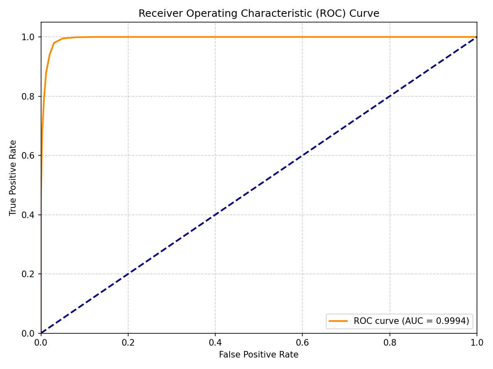
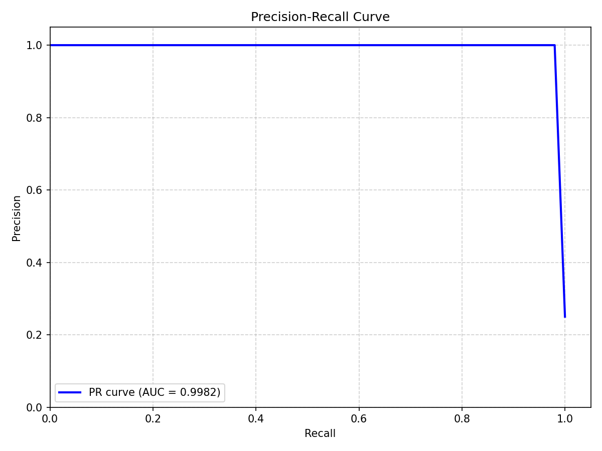
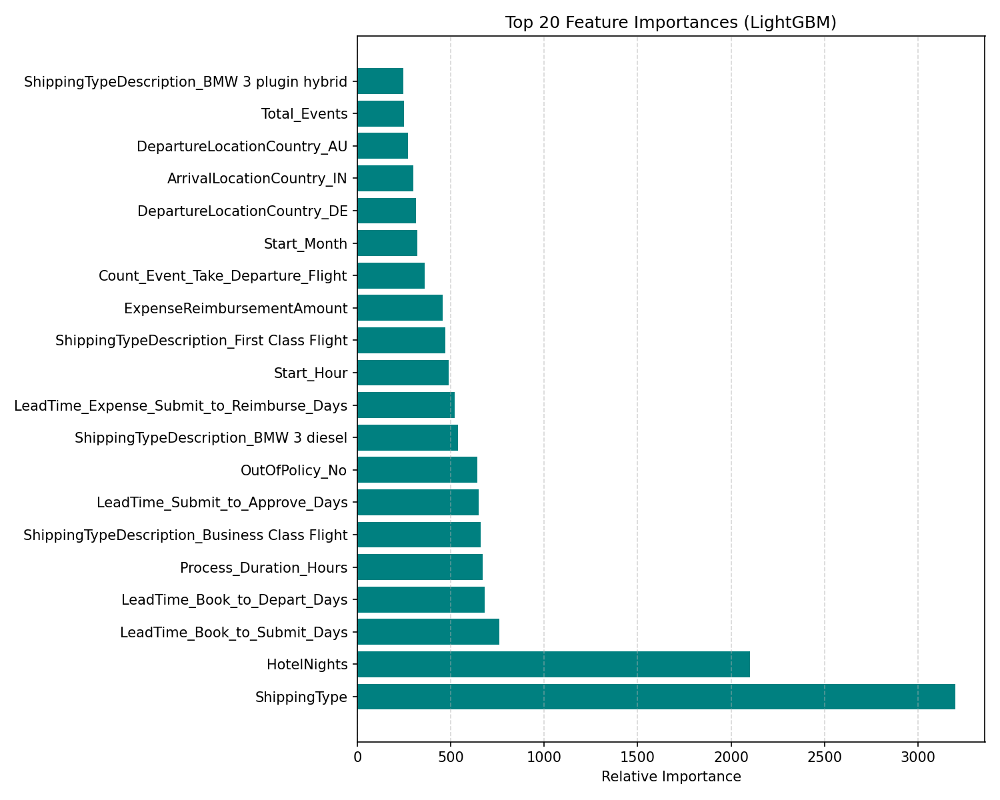
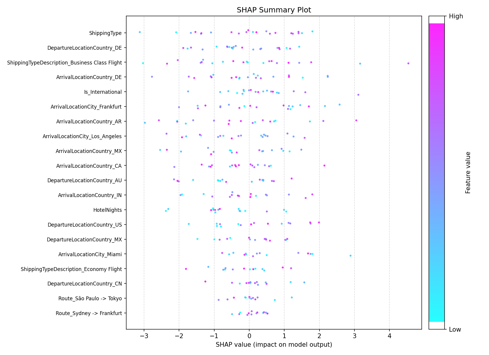
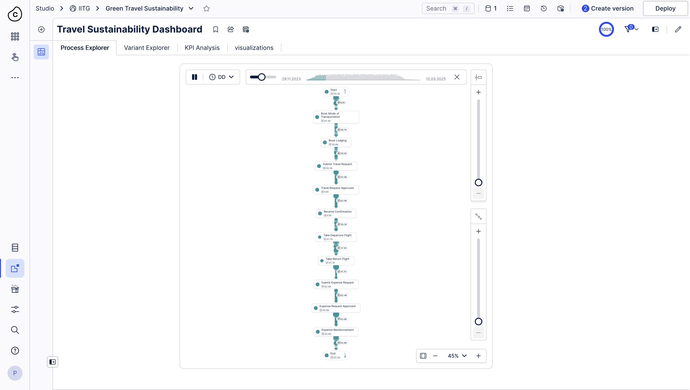
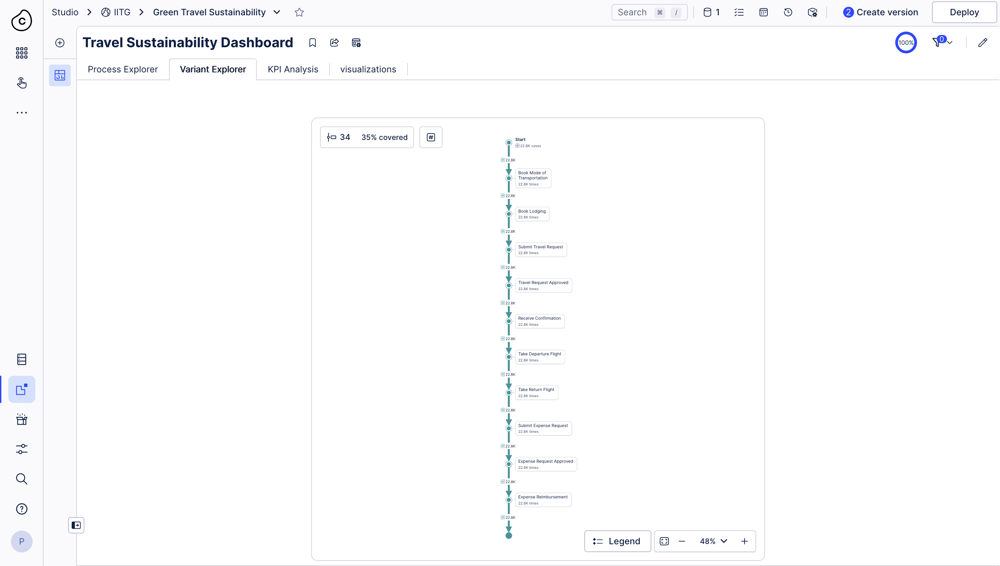
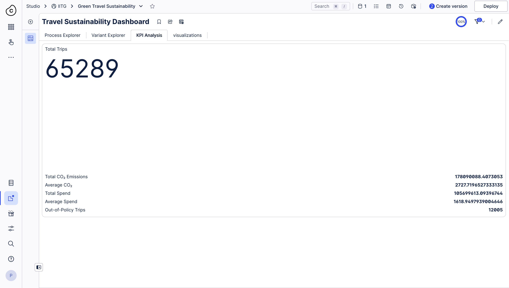
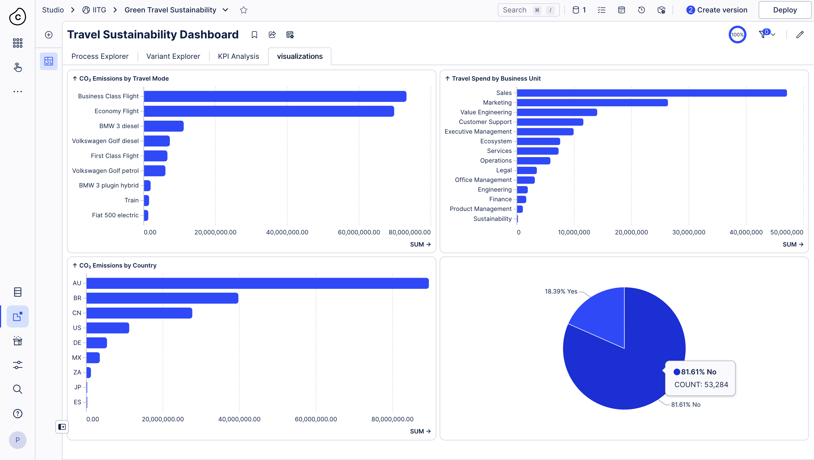

# IIT Guwahati Sustainability Capstone & GreenTravel Intelligence Challenge

An end-to-end analytics and machine learning project for corporate travel sustainability. The pipeline combines process mining insights, feature engineering from travel event logs, and a weighted gradient boosting ensemble to predict high-carbon trips before booking.

## Project Layout

This workspace snapshot contains the following project files:

```text
Main Project/
├── README.md
├── requirements.txt
├── configs/
│   └── config.yaml
├── models/
├── src/
│   ├── config.py
│   ├── data_loader.py
│   ├── evaluator.py
│   ├── feature_engineering.py
│   ├── model_trainer.py
│   ├── pipeline.py
│   └── visualizer.py
└── executive_sustainability_report.md
```

Generated artifacts are written to the configured output directories, including trained fold models, evaluation plots, logs, and the final submission file.

## What This Project Does

The pipeline loads trip-level, event-attribute, and event-log tables; cleans the input text; builds trip-level features; trains three classifiers; combines them with a weighted ensemble; evaluates the model; and exports predictions for the private test set.

The implemented workflow is:

1. Load public training data and private test data.
2. Engineer features from trip metadata, event logs, and event attributes.
3. Train LightGBM, XGBoost, and CatBoost with 5-fold stratified cross-validation.
4. Search for the best ensemble weights using OOF predictions.
5. Optimize the classification threshold for F1 score.
6. Generate ROC, precision-recall, feature importance, and SHAP summary plots.
7. Produce a submission CSV with predicted `HighCarbon` probabilities.

## Data Requirements

The code expects the raw competition files to be available locally. In the current snapshot, those CSVs are not committed, so you will need to provide them before running the pipeline.

Expected inputs are:

* public trip details
* public event attributes
* public event log
* private trip details
* private event attributes
* private event log
* a sample submission template

If you keep the existing configuration layout, update `configs/config.yaml` so the data paths point to your local files.

## Setup

Use Python 3.8 or newer. Python 3.11 or 3.12 is preferred for smoother installs of `shap` and `numba`.

```bash
cd "Main Project"
python3 -m venv .venv
source .venv/bin/activate
pip install -r requirements.txt
```

## Run The Pipeline

From inside the `Main Project` folder:

```bash
python src/pipeline.py
```

To run the optional LightGBM hyperparameter search with Optuna:

```bash
python src/pipeline.py --tune
```

The script writes logs to the configured outputs directory and saves fold models under `models/`.

## Feature Engineering

Feature generation is implemented in `src/feature_engineering.py` and is designed to avoid leakage from target or emissions columns.

Engineered features include:

* process duration and total event counts
* unique event counts and per-event frequencies
* booking, approval, departure, and reimbursement lead times
* day-of-week, month, quarter, and weekend indicators
* route-level indicators such as international travel flags
* one-hot encoded categorical attributes

The leakage columns excluded from training are:

* `Departure_CO2e`
* `Return_CO2e`
* `Hotel_CO2e`
* `Spend_CO2e`
* `TotalCO2e`
* `HighCarbon`

## Modeling

`src/model_trainer.py` implements the training loop.

* 5-fold stratified cross-validation is used for each model.
* The model family is LightGBM, XGBoost, and CatBoost.
* Out-of-fold predictions are combined with a weighted ensemble.
* Fold checkpoints are serialized with `joblib` into `models/`.

Validation behavior is handled by `src/evaluator.py`.

* The decision threshold is selected by grid search over F1 score.
* The best threshold used in this project is `0.300`.

## Reported Results

The current pipeline and report describe the following validation performance:

* Weighted ensemble ROC-AUC: `0.99935`
* Validation F1 score: `0.98670`
* Validation accuracy: `99.337%`
* Validation precision: `98.953%`
* Validation recall: `98.389%`

The reported confusion matrix at the optimized threshold is:

```text
[[48793   170]
 [  263 16063]]
```

## Model Evaluation Images

The pipeline writes these plots into the outputs directory.

### ROC Curve



### Precision-Recall Curve



### LightGBM Feature Importance



### SHAP Summary



## Dashboard Images

The Celonis dashboard screenshots available in this workspace are embedded below.

### Process Explorer



### Variant Explorer



### KPI Analysis



### Visualizations



## Outputs

When the pipeline completes successfully, it produces:

* trained fold models in `models/`
* ROC and precision-recall curves in the outputs directory
* a LightGBM feature importance plot
* a SHAP summary plot
* copied dashboard screenshots in `outputs/dashboard/`
* `evaluation_metrics.json`
* a final submission CSV

## Business Deliverables

The repository also includes the business-facing sustainability report:

* `executive_sustainability_report.md` - summary of emissions hotspots, predicted impact, and recommended operational changes.

The report highlights an estimated annual potential of:

* 13,200 tons CO2e reduction
* $12.8M annual cost savings

## Troubleshooting

If the pipeline cannot find the config file or data files, first verify that you are running from the `Main Project` directory and that `configs/config.yaml` points to the correct local paths.

If `shap` or a tree-boosting package fails to install, upgrade `pip` and ensure you are using a supported Python version.
